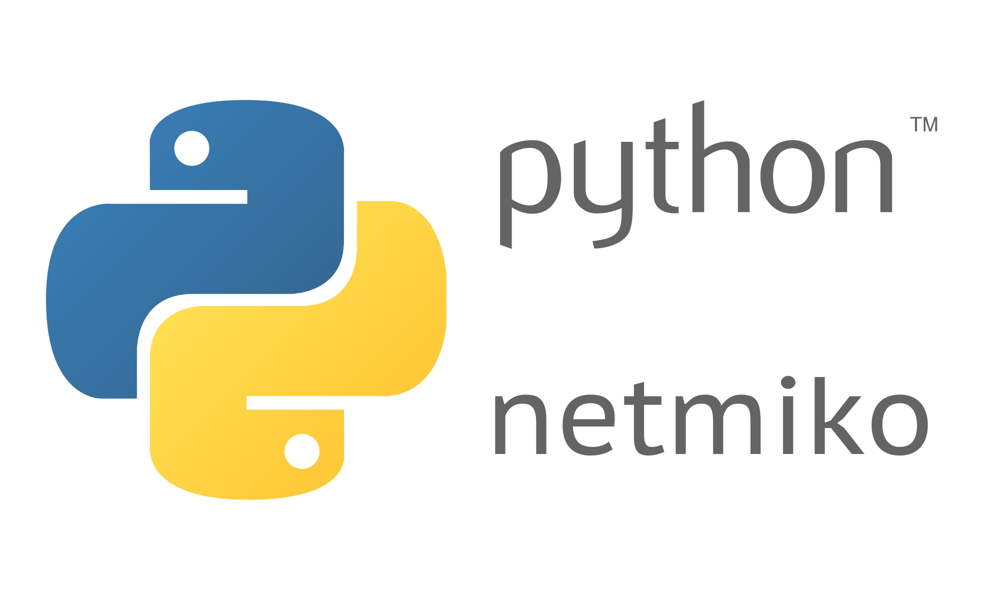

Automação de Ambientes Cisco com Python e Netmiko
======================================

## IaC - Infra as Code

(Python3, Netmiko, Eve-ng, Pycharm)

Criação de Script em Python3 e o Netmiko para automatizar tarefas em ambientes cisco (roteadores/switches).

Biblioteca Netmiko:

Os objetivos desta biblioteca são os seguintes:

- Estabelecer com sucesso uma conexão SSH com o dispositivo
- Simplifique a execução de comandos show e a recuperação de dados de saída
- Simplifique a execução de comandos de configuração, incluindo possivelmente ações de confirmação
- Amplo conjunto de fornecedores e plataformas de rede

Requisitos
------------

- Python3
- PIP3
- IDE Python (Pycharm)
- Biblioteca Netmiko
- Eve-ng (Ambiente de teste/homologação)
- Imagens de Routers e Switches Cisco

Dependências
------------

        Em desenvolviento. Aguardem...

Subindo e destruindo o Ambiente
--------------------------------

        Em desenvolvimento. Aguardem...

Extras
--------

        Em desenvolvimento. Aguardem...

Informações do Autor
------------------

- Este projeto foi criado por Willdimark Ragazzi Ventura, DevOps Engineer. (<fininho.cetec@gmail.com>)
- Linkedin [Perfil](https://www.linkedin.com/in/willdymark-ragazzi-ventura-ccna-devnetsecops-membro-anppd%C2%AE-a4422617//).
